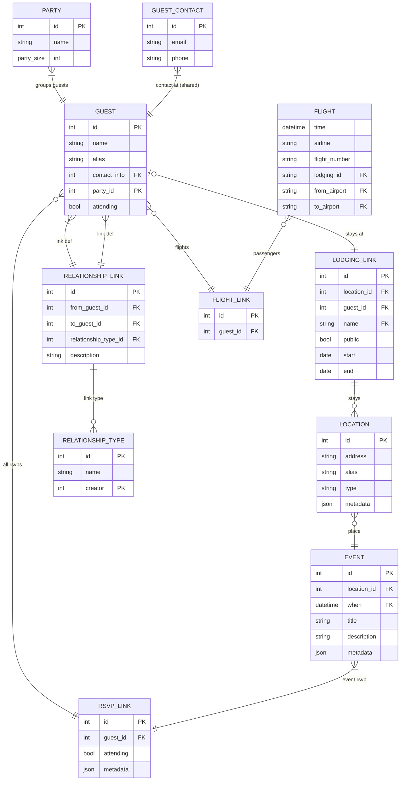

# Models

This page contains all the models for this wedding app. 
The models relationships are defined the the mermaid diagram below.

```mermaid

erDiagram
		GUEST {
			int id PK
			string name
			string alias
			int contact_info FK
			int party_id PK
			bool attending
		}
		
		GUEST_CONTACT {
			int id PK
			string email
			string phone
		}
		
		%% can be alias for a lot of things
		PARTY {
			int id PK
			string name
			party_size int
		}
		
		%% Helps coordinate events
		LOCATION {
			int id PK
			string address
			string alias
			%% lodging | airport | wedding event
			string type  
			%% Used for random crap
			json metadata
		}
		
		%% At the wedding
		EVENT {
			int id PK
			int location_id FK
			datetime when FK
			string title 
			string description 
			json metadata
		}
		
		RSVP_LINK {
			int id PK
			int guest_id FK
			bool attending
			%% could put food preferences in here?
			json metadata
		}
			
		%% Network Graph
		
		RELATIONSHIP_TYPE {
			int id PK
			string name
			int creator PK
		}
		
		RELATIONSHIP_LINK {
			int id PK
			int from_guest_id FK
			int to_guest_id FK
			int relationship_type_id FK
			string description
		}


		%% Travel Tools
		
		%% Find people at/near you
		%% Help coordinate ubers
				
		%% I want to find people going to airport with me
		%% I want to find people leaving airport with me
		%% I want to find ubers to share based on my location
		
		LODGING_LINK {
			int id PK
			int location_id FK
			int guest_id FK
			string name FK
			bool public
			date start
			date end
		}
		
		%% Need copy to guests
		FLIGHT_LINK {
			int id PK
			int guest_id FK
		}
		
		FLIGHT {
			datetime time
			string airline
			string flight_number
			string lodging_id FK
			string from_airport FK
			string to_airport FK
		}
		

		%%% All the connections
		
		%% Guest Groupings
		GUEST_CONTACT many(1) to only one GUEST : "contact at (shared)"
		PARTY many(1) to only one GUEST : "groups guests"
		
		%% Guest RSVP
		LOCATION many to only one EVENT: "place"
		EVENT many(1) to only one RSVP_LINK: "event rsvp"
		GUEST many to only one RSVP_LINK: "all rsvps"
		
		%% Travel tools
		GUEST zero or one to only one LODGING_LINK : "stays at"
		LODGING_LINK only one to many LOCATION : "stays"
		
		FLIGHT many to only one FLIGHT_LINK: "passengers"
		GUEST many to one FLIGHT_LINK: "flights"
		
		
		%% Fun Relationship Graph 
		GUEST many(1) to only one RELATIONSHIP_LINK : "link def"
		RELATIONSHIP_LINK only one to many(1) GUEST : "link def"
		RELATIONSHIP_LINK only one to many RELATIONSHIP_TYPE: "link type"
```
